# Expass 3
## Technical difficulties
I had some issues installing MongoDB on my Ubuntu. before reading any of the instuctions, i naively just opened a terminal and typed `sudo apt install mongodb` and thought and laughed and Windows users and how installing things is unneccesarily complex. Then after reading that apt's mongodb is not maintained by the MongoDB team, i had to uninstall it.
Also, after seemingly successfully installing the correct mongodb version, my database successfully loaded, but immediately crashed and returned exit code 14. The cause of error code 14 is accoring to the MongoDB manual "Returned by MongoDB applications which encounter an unrecoverable error, an uncaught exception or uncaught signal. The system exits without performing a clean shutdown.". This was discouraging as it is super vague. After an hour or so of surfing through StackOverflow and trying different solutions and reading logfiles. i realized that MongoDB had issues with getting the permissions to create a folder `/var/lib/mongodb`. So i created the folder myself, and everything worked. Huzzah!

# Screenshots experiment 1
## Verification:
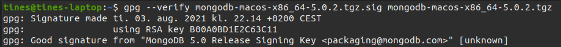

## Insert documents:
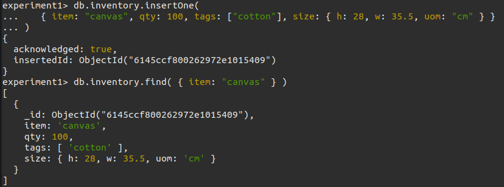

## Query documents:
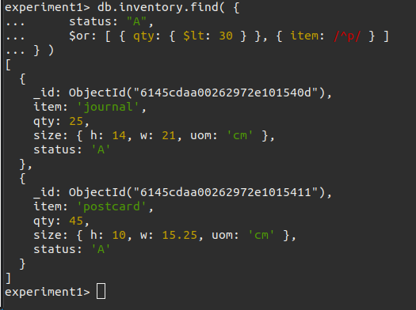

## Update documents:
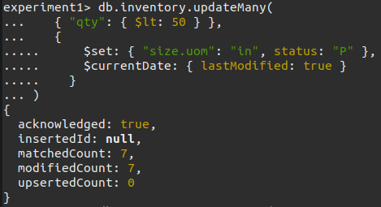

## Remove documents:
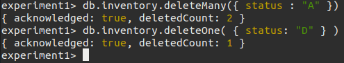

## Bulk write operations:
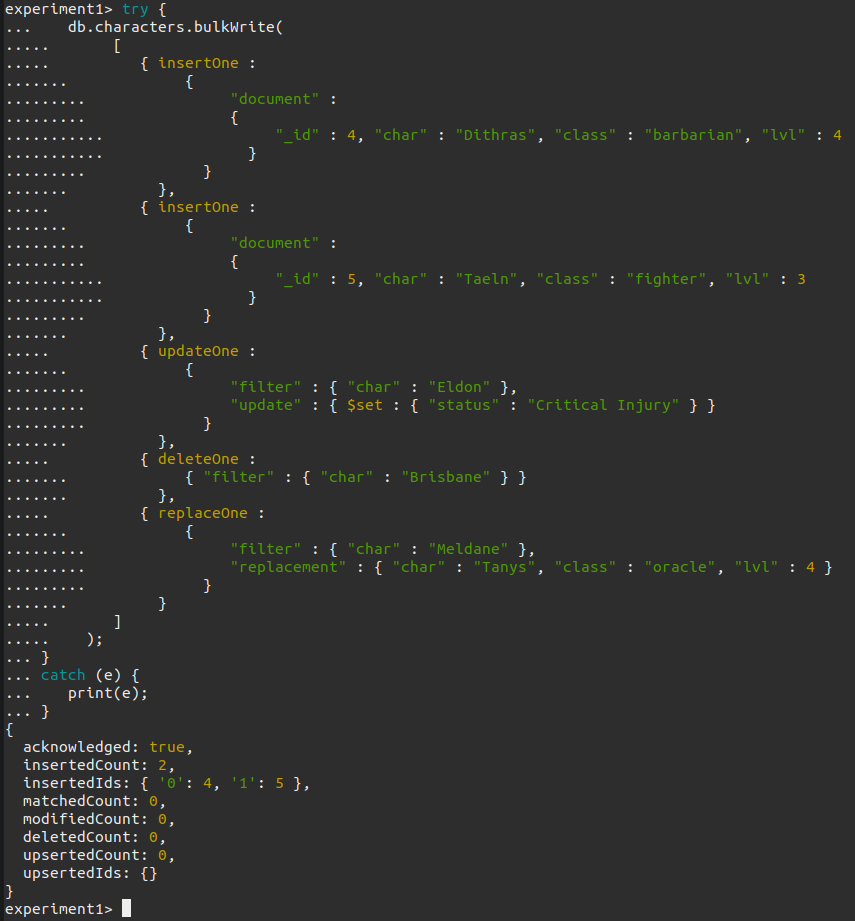

# Screenshots experiment 2
## Screenshots of the example working
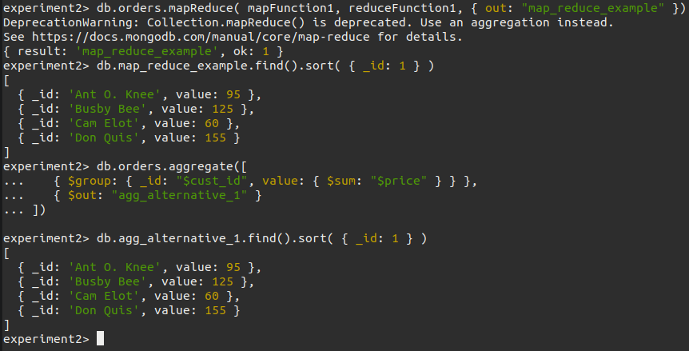
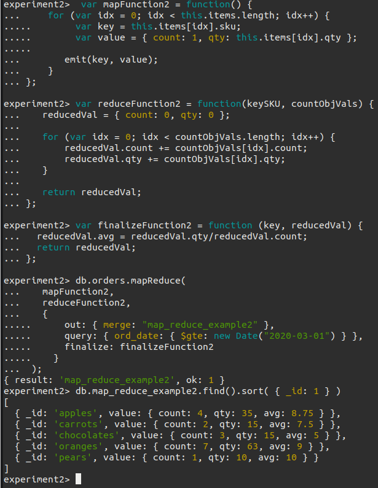
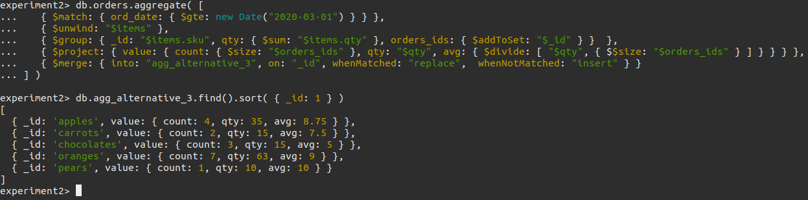
# My map-reduce 
## Return the total earnings per day
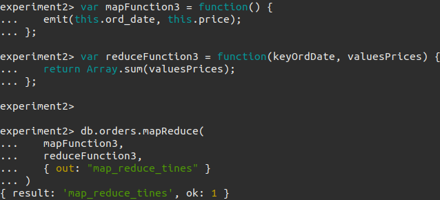
## Result
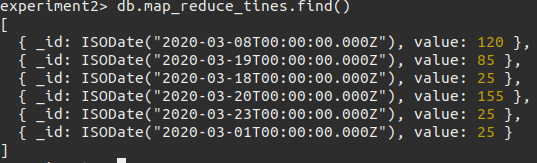
### The date is being printed ugly, but it works!